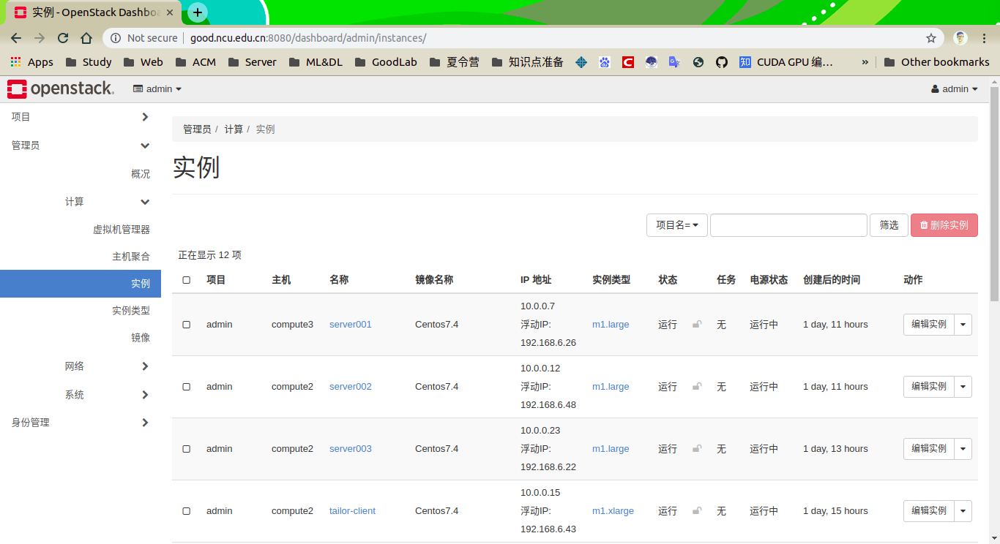
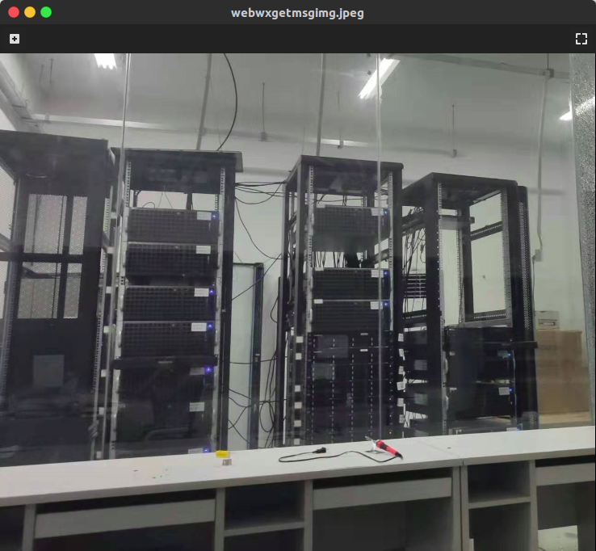
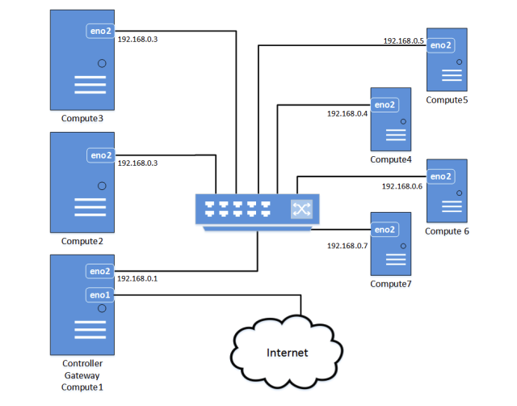

## NCU Good 实验室openstack部署

这学期对虚拟化技术很感兴趣，刚好实验室有一个小的集群，虽然最近docker技术非常火，但考虑到学院很多师生对命令行并不熟悉，所以选择了openstack虚拟化实验室的集群，使得可以为用户提供Windows环境和图形界面。最近实验买了很多GPU： 8块 tesla v100和一台DGX-STATION，但是对于GPU的虚拟化部分还不是很熟悉，目前项目只是结合OpenStack管理系统实现了简单的用户认证和实例使用，有时间将会尝试：
- 基于Hadoop实现大数据计算集群服务，用户可以以最便捷的方式启动Hadoop进行计算任务。
- 基于K8S，kubeflow，gpu 加速设备实现caffe，tensorflow 等深度学习高性能计算集群。
- 基于Gluster FS实现云存储系统。

整理仓促，有时间我将会openstack的搭建过程整理上传，对openstack感兴趣的朋友可以参照（<https://www.openstack.org/>）进行部署使用

#### 项目界面

####　物理架构图

  

#### openstack架构图

集群有一个控制节点和多个计算节点，同时控制节点也承担的计算节点的角色。控制节点的网卡一(eno1)接入外网，提供neutron网络的物理接口,网卡二(eno2)作为内网的管理网卡。整个结构充分的利用了物理资源，实现了一个简单的OpenStack集群。为了使内网的机器可以访问外网，我们将控制节点网卡二(eno2)的流量转发到网卡一(eno1)以网卡二的地址作为内部机器的网关。